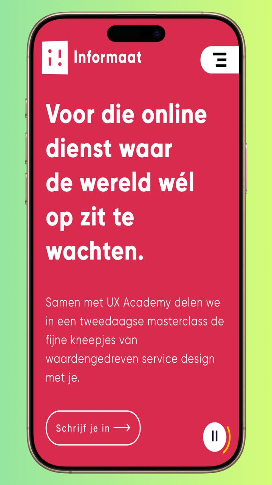
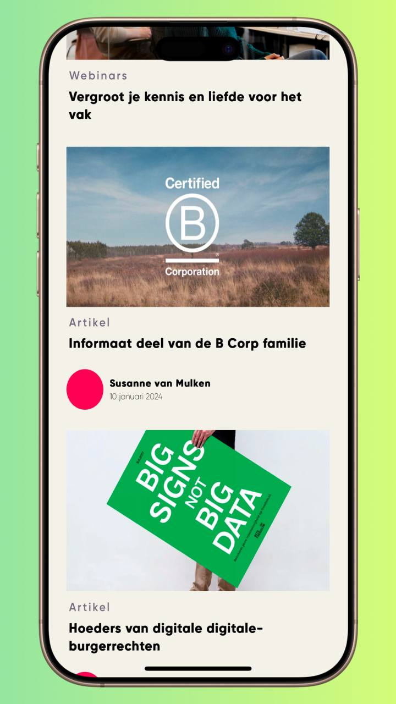
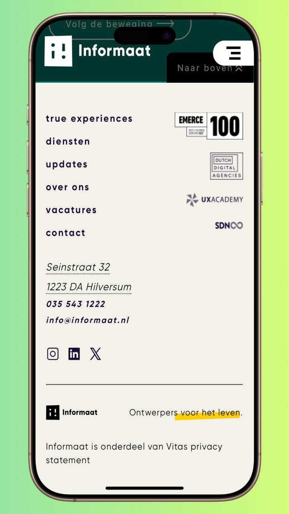

Ontwerp en maak een responsive website voor een startup.

De instructies voor deze opdracht staan in: [INSTRUCTIONS.md](https://github.com/fdnd-task/the-startup-responsive-interactieve-website/blob/main/docs/INSTRUCTIONS.md)

# Titel
Informaat revising

### informaat
Informaat is een bedrijf dat zich richt op het ontwerpen van digitale producten zoals websites en apps. Ze maken UX-concepten die goed functioneren en toegankelijk zijn om te gebruiken. Het bedrijf houdt zich ook bezig met UI-concepten om het product er mooi en aantrekkelijk uit te laten zien. Hierbij gebruiken ze verschillende frontendprincipes.

Informaat maakt gebruik van design systems en richt zich ook op contentarchitectuur en waardeproposities. Ze werken intensief samen met andere UX-designers en projectteams.

### De opdracht
In de UX wereld is het belangrijk om vernieuwende designs te blijven produceren omdat je als bedrijf op deze manier laat zien dat je in staat bent constant up to date te blijven. Om dit werkelijk te maken is het de bedoeling dat de homepagina geudate wordt aan de hand van het nieuwe design.

#### Randvoorwaarde
- De frontend code die gemaakt moet worden, moet op een bepaalde manier gestructureerd worden zodat de verschillende content secties op de pagina hergerbruikt kunnen worden.
- De huisstyle van informaat moet behouden worden.
- Er mag afgeweken worden van het design, maar met onderbouwing waarom.
- De website moet een werkende interactie hebben


## Beschrijving
De homepagina is het visitekaartje van het bedrijf. Hier kunnen partners en toekomstige klanten meer te weten komen over het bedrijf Informaat.

De homepagina bestaat uit een aantal secties. Je hebt de gebruikelijke elementen waaronder de navigatiebar en footer, maar ook de main content. De main content gaat voornamelijk over wie Informaat is, wat het doet, waar het voor staat en enkele voorbeelden van organisaties waarvoor ze gewerkt hebben.

Enkele voorbeelden van de verschillende secties:

  <figure style="display: inline-block; text-align: center; margin-right: 10px;">
    
    <figcaption>Hero-sectie</figcaption>
  </figure>

  <figure style="display: inline-block; text-align: center; margin-right: 10px;">
    
    <figcaption>Inzichten</figcaption>
  </figure>

  <figure style="display: inline-block; text-align: center; margin-right: 10px;">
    
    <figcaption>Footer</figcaption>
  </figure>


### Responsive
De website is ontwikkeld volgens het mobile-first principe. Vervolgens heb ik de site responsive gemaakt door de verschillende breakpoints te onderzoeken en vervolgens door het gebruik van media queries,clamp en auto grid layouts heb ik de layout aangepast voor verschillende schermgroottes.

[Demonstratie van enkele breakpoints](./Assets/readme-assets/Screen%20Recording%202025-01-23%20at%2000.23.44.mp4)
<!-- In de Beschrijving staat hoe je project er uit ziet, hoe het werkt en wat je er mee kan. -->
<!-- Voeg een mooie poster visual toe 📸 -->
<!-- Voeg een link toe naar Github Pages 🌐-->


<!-- ### Ontwerpkeuzes
Op de pagina heb ik twee interacties gemaakt, namelijk de scrollbutton en de navbar die verdwijnt en verschijnt door het scrollen.

#### scrollbutton
Deze button is bedoeld voor als de gebruiker helemaal onderaan de pagina is en rechtstreeks weer helemaal naar boven wilt gaan. Het design van de button kwam vanuit de opdrachtgever. -->

## Kenmerken
<!-- Bij Kenmerken staat welke technieken zijn gebruikt en hoe. Wat is de HTML structuur? Wat zijn de belangrijkste dingen in CSS? Wat is er met JS gedaan en hoe? -->

### Html
Op de homepagina heb ik de HTML zo geschreven dat het duidelijk is wat elk onderdeel van de pagina doet. Ik heb semantische HTML gebruikt, hierdoor is het makkelijker voor zowel mensen als zoekmachines om de gegevens te begrijpen.

Ik heb de verschillende secties van de pagina verdeeld in zogenoemde "content-blocks". Hierdoor heb ik ervoor gezorgt dat elke sectie van elkaar is gescheiden wat ervoor zorgt dat de code gemakkelijk hergebruikt -of gestructureerd kan worden. Met een comment heb ik ook alle onderdelen genummerd voor extra duidelijkheid.

[html](https://github.com/Ravirkt/the-startup-responsive-interactive-website/blob/9b3cf2dbbaccc5dd87937c09d5bded87f3c9885e/index.html#L1)


### Css
het belangrijkste van de Css code was het maken van de layout. Dit heb ik voornamelijk gedaan met `display: grid;` gecombineerd met `display: flex`. Ook heb ik bij secties waar elementen buiten de grid vallen `position` gebruikt.

Ik heb twee Css files. De ene is voor styling van de homepagina en de andere file is de styleguide. Hierin heb ik de algemene styling en huistijl properties van de pagina. Hier kun je bijvoorbeeld de algemene styling vinden van de buttons of van de headings.

[Styleguide](https://github.com/Ravirkt/the-startup-responsive-interactive-website/blob/9b3cf2dbbaccc5dd87937c09d5bded87f3c9885e/css/styleguide.css#L1)<br>
[Stylesheet](https://github.com/Ravirkt/the-startup-responsive-interactive-website/blob/9b3cf2dbbaccc5dd87937c09d5bded87f3c9885e/css/styling.css#L1)


### Javascript
Met Javascript heb ik een aantal interacties gemaakt, namelijk de scrollbutton aan het einde van de pagina en de navbar die verdwijnt en verschijnt door de een scroll event.

#### scrollbutton
Als een gebruiker aan het scrollen is door de website en uiteindelijk aan het einde van de website is. De gebruiker wilt weer naar boven scrollen. Door op de button te klikken wordt de gebruiker automatisch naar boven gescrollt.

[js code scrollbutton](https://github.com/Ravirkt/the-startup-responsive-interactive-website/blob/8616d6ffd3a676e1c5d21e658d0e15e6c29833b1/javascript/javascript.js#L1-L11)


Met de `document.querySelector` heb ik de button met de class: `("scroll-up-button")` gevonden. Deze button sla ik vervolgens op in de variabele: `const scrollUpButton`.

`scrollUpButton.addEventListener("click", scrollUp)` Met deze regel code koppel ik een click eventListener aan de button. Ook heb ik een functie meegegeven genaamd: `scrollUp`. Als er op de button wordt gedrukt zal de functie `scrollUp` uitgevoerd worden.

```javascript
const scrollUpButton = document.querySelector(".scroll-up-button");
scrollUpButton.addEventListener("click", scrollUp)

function scrollUp () {

  window.scrollTo({
    top: 0, 
    behavior: "smooth" 
  });
}
```

In `window.scrollTo` geeft window de venster van de browser aan en `scrollTo` is een Javascript method waarmee je naar een bepaalde positie kan scrollen. Je kan hier verschillende globale en specifieke waardes voor opgeven. Om verticaal naar boven te scrollen gebruik ik `top: 0`. Met `behavior: "smooth"` zorg ik ervoor dat de scrollbeweging soepel verloopt.

#### scroll navbar

Om de gebruiker meer ruimte te geven om de content op de website te zien heb ik met Javascript ervoor gezorgt dat de navbar automatisch verdwijnt en verschijnt als je naar boven en beneden scrollt.

[Code js navbar scroll](https://github.com/Ravirkt/the-startup-responsive-interactive-website/blob/5bf89787b257de72cba88987a5811b5f9edf4173/javascript/javascript.js#L22-L48)


Met de `document.querySelector` heb ik de navigatiebar met de class: `(".navbar")` gevonden, omdat ik dit element wil manipuleren. Het navbar element sla ik vervolgens op in de variabele: `const nav`.

Vervolgens heb ik de variabele `let lastScrollY`. In deze variabele wil ik met `window.scrollY` de huidige scrollpositie bewaren.

`window.addEventListener("scroll", scrollUpDown)` Met deze regel code koppel ik een scroll eventListener aan de `window`. Dit moet op de window omdat het scrollen gebeurt in de window. Ook heb ik een functie meegegeven genaamd: `scrollUpDown`. Als er wordt gescrollt zal de functie `crollUpDown` uitgevoerd worden.


```javascript
const nav = document.querySelector(".navbar");
let lastScrollY = window.scrollY;

window.addEventListener("scroll", scrollUpDown);

function scrollUpDown() {
  
//   Dit is voor het verbergen en verschijnen van navabr
  if (lastScrollY < window.scrollY) {
    nav.classList.add("hide-nav");
  } else {
    nav.classList.remove("hide-nav");
  }

// Dit is voor de background color van de navbar
  if (window.scrollY > 1) {
    nav.classList.add("color-nav");
  } else {
    nav.classList.remove("color-nav");
  }

  lastScrollY = window.scrollY;
}
```

Met een if statement ga ik nu controleren of de waarde van `lastScrollY` kleiner is dan `window.scrollY`. Als dat wel het geval is wordt de class `hide-nav` toegevoegt. Is de waarde van `lastScrollY` groter, zal de class removed worden.

De waarde naar beneden scrollen is groter dan naar boven scrollen. Wanneer je de page refreshed zijn beide waardes nul.

`lastScrollY = window.scrollY;`. Aan het einde van de functie komt deze regel code. Deze code slaat de huidige waarde van `window.scrollY` op in de variabele `lastScrollY`, zodat deze waarde weer gebruikt kan worden wanneer er weer gescrollt wordt.

Met een if statement ga ik nu controleren of de waarde van `window.scrollY` groter is dan 1. Als dat wel het geval is wordt de class `color-nav` toegevoegt. Is de waarde van `window.scrollY` groter, zal de class removed worden.

De background achter de navbar heb ik bedacht omdat de navbar witte elementen heeft. De content van de site bevat veel lichte kleuren. Voor de gebruiker is de navbar dus niet duidelijk zichtbaar op bepaalde punten in de website.


<!-- ------- code conventions -->

## Refactoring en Code Conventions

### ademruimte en inspringen
Ik heb de verschillende sections onderverdeeld in content blokken, zodat elke sectie in de webpagina gescheiden is van elkaar. 

Elke sectie wordt gescheiden door een html comment met daarin welke contentblok het is.

- Inspringen: 1 tab;
- Block-elementen: Op meerdere regels
- Inline-elementen: Op dezelfde regels, tenzij de regel heel lang is.

Voorbeeld in Html:

```html
<div class="ham-menu" aria-label="Open het navigatiemenu" tabindex="0" role="button">
    <span class="bar-1 hover" aria-hidden="true"></span>
    <span class="bar-2 hover" aria-hidden="true"></span>
    <span class="bar-3 hover" aria-hidden="true"></span>
</div>
```


### Volgorde en nesten van CSS selectors
- De css selectors hebben dezelfde structuur als de volgorde van de html code. [Voorbeeld](https://github.com/Ravirkt/the-startup-responsive-interactive-website/blob/9b3cf2dbbaccc5dd87937c09d5bded87f3c9885e/css/styling.css#L1)
- De css wordt geformateerd met de vscode shortcut. [Voorbeeld](https://github.com/Ravirkt/the-startup-responsive-interactive-website/blob/9b3cf2dbbaccc5dd87937c09d5bded87f3c9885e/css/styling.css#L1)
- De verschillende contentblokken worden gescheiden met een comment. [Voorbeeld](https://github.com/Ravirkt/the-startup-responsive-interactive-website/blob/9b3cf2dbbaccc5dd87937c09d5bded87f3c9885e/css/styling.css#L11)


### Nesten van media queries
- De media queries zijn genest in betreffende element. [Voorbeeld](https://github.com/Ravirkt/the-startup-responsive-interactive-website/blob/9b3cf2dbbaccc5dd87937c09d5bded87f3c9885e/css/styling.css#L938-L958)
- De css elementen nest ik op logische volgorde, van klein naar groot. [Voorbeeld](https://github.com/Ravirkt/the-startup-responsive-interactive-website/blob/9b3cf2dbbaccc5dd87937c09d5bded87f3c9885e/css/styling.css#L829-L840)

Voorbeeld van @media query:

```css
header {
  height: 90vh;
  padding-left: 1.5em;
  padding-right: 1.5em;
  display: grid;
  grid-template-columns: 1fr 1fr;
  grid-template-rows: auto;
  gap: 0.5em;

  @media (min-width: 700px) {
    grid-template-columns: 1fr 1fr;
    grid-template-rows: 1fr 1fr 1fr 1fr;
    gap: 1.5em;
    height: 70vh;
  }

  @media (min-width: 1024px) {
    height: 100vh;
  }
}
```

### Naamgeving

#### Html en Css
- De namen geven een duidelijke beschrijving van het element.
- Voor namen van bijvoorbeeld classes en id's gebruik ik kebab case, waarbij ik een streepje tussen elk woord zet, bijvoorbeeld: 'header-name'.
  - css [Voorbeeld](https://github.com/Ravirkt/the-startup-responsive-interactive-website/blob/9b3cf2dbbaccc5dd87937c09d5bded87f3c9885e/css/styling.css#L812)
  - html [Voorbeeld](https://github.com/Ravirkt/the-startup-responsive-interactive-website/blob/9b3cf2dbbaccc5dd87937c09d5bded87f3c9885e/index.html#L286)

#### Javascript
- De namen geven een duidelijke beschrijving van het element.
- Bij namen van bijvoorbeeld variabelen in Javascript gebruikt ik Camelcase. Hier begint het eerste woord zonder hoofdletter en de rest wel.
  - js [Voorbeeld](https://github.com/Ravirkt/the-startup-responsive-interactive-website/blob/9b3cf2dbbaccc5dd87937c09d5bded87f3c9885e/javascript/javascript.js#L1)


<!-- -------------------- -->
## Bronnen

## Licentie

This project is licensed under the terms of the [MIT license](./LICENSE).


